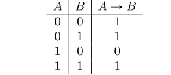
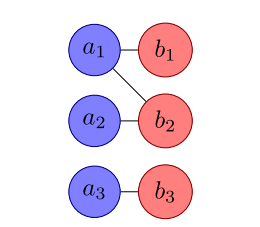

#subject
[Semester:: 2]   •   [Year:: 1]   •   [ECT:: 6]• [Completed:: ✅]
# Chapter 1: Introduction

_**Discrete**_ is usually referred to something which is finite or is a countably infinite sets.

### Definition 1.1 (Set):

A **set** S is called countable if there exists a one-to-one or injective function.

### Planar Graph:

A **planar graph** is a graph that can be embedded in the plane. It can be draw in such a way that no edges cross each other. Bellow is an example of a _planar graph_:

Butterfly graph.svg

Bellow is a an example of what a _Non-planar Graph_ looks like:

Complete graph K5.svg

# Chapter 2 : Propositional Logic

## 2.1 Definitions

### Definition 2.1 (Proposition):

It is a a sentence, expression, or a formula which is either _true_ or _false_.

### Definition 2.2 _(Atom)_:

It is a basic proposition that is not _composed_ of other propositions.

### Definition 2.3 _(Connective)_:

It is a link which links two proposition, which is not composed of other propositions.

**Bellow is an example of a _Composed Proposition_:**
![[../../Attachments/composedProposition.png|500]]

### 2.1.1 Connectives as truth functions:

_**Connective**_ is a function which is applied to propositions, which yields to another. They can be also fully characterized by a _truth table_.

### **Conjunction:**

The **AND** gate is the connective that returns true if and only if both arguments are true.
![[../../Attachments/conjunction.png]]

### Negation:
The **NOT** gate returns the **opposite** of the input truth value.

### NAND:

The two gates above can also be **combined** so that it can make a **new gate**, which is a **negation** of **AND** gate.

### Inclusive Disjunction:

The **OR** gate returns _**true**_ whenever at least there is one of the two inputs **is true**.

### Exclusive Disjunction:

The exclusive Or or XOR gate returns _**true**_ if and only if **exactly one** of the two arguments is true.

### Logical Equivalence:

In this is would return _**true**_ if and only if the arguments **have the same truth value.**

### Implication:

This form states that A to B is _true_ whenever the fact that A is _true_ which unavoidably means that also B is _true_. Therefore, A is called the _premise_ and B is called the the _conclusion_. Such as in the bellow example:

## 2.2 Syntax of Propositional Logic:

The **language** has:

### Definition 2.4 (Well-formed Formula):

A formula is a well-formed formula (wff) if it is build from the elements above according to specific rules.

**Rules of Well-Formed Formula:**

1.  Any proposition is a wff.
2.  If **δ** is a wff, then **¬δ** is a wff.
3.  if **δ** and β are wffs than so is,
    -   **δ ↔ β** is a wff.
4.  Nothing else is a wff if the above conditions don’t satisfy.

## 2.3 Semantics of Propositional Logic

### Definition 2.5 (Assignment):

A _truth assignment_ is a function that assigns a truth value to every atom. This _truth function_ is extended to all syntactically correct formulas (wff) by simply evaluating the formula, based the truth values for its atoms and the connectives used.

### Definition 2.6 (Semantic Behavior / Truth Vector):

The _semantic behavior_ or _truth vector_ of a proposition is the list of truth values for all possible assignments.

**Example:**

### Definition 2.7 (Semantic Equivalence):

Two formulas are _semantically equivalent_ if they have the same truth value for all assignments of their atomic formulas. It is then written as “**F ≡ G** or **F ⇔ G**”

**Example:**

### Definition 2.9 (Tautology, Unsatisfiable Formula):

If a formula _F_ is semantically equivalent to 0, **F ≡ 0**, then _F_ is called _**unsatisfiable**_.

If a formula _F_ is semantically equivalent to 1, **F ≡ 1**, then _F_ is called a _**tautology**_.

### Theorem 2.3.1:

Two formulas F and G are semantically equivalent, i.e., F ⇔ G, if and only if the formula F ↔ G is a tautology.

### Logical Laws:

### Idempotence:

### Symmetry:

### Associativity:

### Absorption:

### Distributivity:

### de Morgan:

### Double Negation:

## 2.4 Normal forms:

A clause that contains only **V** is called a **disjunctive clause** and only **∧** is called **conjunctive clause**.

-   Negation is allowed, but only on variables.
-   _p_ **∨** **¬**q **∨** r: **a disjunctive clause**
-   **¬**p **∧** q **∧** ¬r: **a conjunctive clause**
-   **¬**p **∧** **¬**q **∨** _r_: **neither**

If we put a bunch of disjunctive clauses together with **∧** it is called **conjunctive normal form**.

-   **For example:** (p **∨** r) ∧ (**¬**q **∨** **¬**r) **∧** q is in _conjunctive normal form_.

Similarly, putting conjunctive clauses together with **V**, it is called **disjunctive normal form**.

-   **For example:** (p **∧** **¬**q **∧** r) **∨** (**¬**q **∧** **¬**r) is in _disjunctive normal form_.

More Examples:

-   (p **∧** q **∧** **¬**r **∧** s) **∨** (**¬**q **∧** s) **∨** (p **∧** s) is in _disjunctive normal form_.
-   (p **∨** q **∨** **¬**r **∨** s) **∧** (**¬**q **∨** s) **∧** **¬**s is in _conjunctive normal form_.
-   (p **∨** r) **∧** (q **∧** (p **∨** **¬**q)) is **not** in a _normal form_.
-   **¬**p **∨** q **∨** r and **¬**p **∧** q **∧** r are in both _normal forms_.

We can also turn any proposition into either normal form.

-   We can use the **definitions** to get rid of →, ↔, and ⊕.
-   Use **DeMorgan’s** laws to move ¬ in past parens, so they sit on the variables.
-   Use **double negation** to get rid of any ¬¬ that showed up.
-   Use distributive rules to move things in/out of parens as we need to.

Examples of turning proposition in either normal form:

Why would it be needed to convert proposition to Normal Form?

-   May be easier to prove equivalence: to show A **≡** B, convert both to normal form, and then re-write one proof backwards.
-   Maybe we simplify a lot: if we end up with (p **∨** **¬**p **∨** ⋯) terms, we know they are true.
-   Proving theorems about all propositions: only have to handle boolean expressions in a normal form and that covers every proposition.
-   Shows that we can use circuitry to calculate any boolean expression with two layers of logic gates.

**Example:**

## 2.6 Proof Theory of Propositional Logic:

The goal of a proof theory is to decide semantic questions such as

-   Is _F_ a tautology
-   Is _F_ unsatisfiable
-   Does {F1, …. F_n_} = G hold

## 2.7 The Resolution Calculus:

# Chapter 3: Set Theory

All **objects** in mathematics are **sets**.

## 3.1 Basic Notions:

A set is a collection of object, where all these objects are _sets_ themselves, since all _objects are sets_.

### Definition 3.1 (Element Relation):

The relation _“is an element of”_ relates an object (set) x with a set. One says _“x is a element of”_ or _“x is in A”_ or _“A contains x”_ and writes _x_ ∈ _A_ On the other hand, if x is not in A, one writes _x_ ∉ _A_ or, ¬(_x_ ∈ _A_)

### 3.1.1 Cantor’s Paradise:

Georg Cantor who is a the founder of or set theory, where his definition of what a set is, and what objects is very _liberal_ in the sense that set was a collection of _any_ kind of objects with the only condition that these objects be distinguishable from each other:

### Definition 3.2 (Cantor’s naïve approach):

_An collection of a well-distinguished object is a **set**_.

This definition leads to several problem, since if a set can contain itself (which it can’t) then this property can be used to form a new set: The set M of all elements which do not contain themselves as an element: _M_ := _B_|_B_ ∉ _B_ Hence the question comes, if M contain itself. If it does, then it does not, according to the definition. Hence the Naïve set theory crashes.

### Definition 3.3 (Quantifiers):

In order to express that a statement holds for all cases of a kind, one uses the _**universal quantifier**_ **∀**.

If a statement holds for at least one instance of a kind, the _**existential quantifier ∃**_.

### Axiom 1 (Extensionality Axiom):

Two sets are equal if they contain the same elements:

### 3.1.2 Zermelo/Fraenkel/Choice (ZFC) Set Theory:

In a nutshell, ZFC set theory is a set of axioms describing how sets can be formed from other sets.

### Definition 3.4 (Predicate):

Predicate is a function for which when applied to a element of a set yields a true or false output. **P(x) = true/false**

**Example:**

S = [blood, sky, apple]

in predicate logic .isRed() is true for “blood” and “red”, but for “sky” it would return false.

### Axiom 2 (Subsets from Predicates):

Given a set A and a predicate P on A, the collection of all elements that have the property P (i.e. for which P is true)

**Example:**

One can define a predicate on the natural numbers to be true if and only if the argument is less or equal to 10. This yields the set _A_ := {_x_ ∈ ℕ|_x_ ≤ 10} With a second predicate on A returning true if and only if the argument is prime, we obtain _B_ := {_x_ ∈ _A_|_Prime_(_x_)} = {2, 3, 5, 7}

### Definition 3.5 (Subset):

_A_ ⊆ _B_

We read the above as A is a subset of B, if all elements of A are also elements of B:

This operation is not semantic, meaning that all of B does not have to be contained in A.

### Theorem 3.1.1

If a set A is a subset of B and B a subset of A, then the two sets are equal: $$ A \subseteq B \and B \subseteq A \implies A = B $$ **Empty Set:** ∅ := {_x_ ∈ _A_|_x_ ≠ _x_} = {} The above expression mean that if a x which is a subset of A, doesn’t equal to itself, then it is a _**empty set**_.

### Definition 3.6 (Intersection):

Given two set A and B, the _intersection,_ A ∩ B consists of all elements contained in _both_:

### Axiom 3 (Union):

Given _two sets A and B their_ union A ∪ B _containing_ all elements of A as well as all elements of B is a set. $$ x \in A \cup B :\iff x \in A \or x \in B $$

### Definition 3.7 (Difference):

The difference of two sets A and B -denoted A- is defined as the set of all elements contained in A but not in B. $$ x \in A \backslash B :\iff x \in A \or x \notin B $$

### Definition 3.8 (Symmetric Difference):

The _symmetric difference_ is defined using the XOR. _x_ ∈ _A_△_B_ :  ⇔ _x_ ∈ _A_ ⊕ _x_ ∈ _B_ **Example:**

### Definition 3.9 (Power Set):

The _power set_ of a set A is the set of all subsets of A: _x_ ∈ ℙ)_A_() :  ⇔ _x_ ⊆ _A_ The power set is also denoted 2^A as the cardinality, i.e. the number of elements, of the power set is just |ℙ(_A_)| = 2|_A_| **Example:**

If _S_ is the set {x, y, z}, then the subsets of _S_ are

-   {}
-   {x}
-   {y}
-   {z}
-   {x, y}
-   {x, z}
-   {y, z}
-   {x, y, z}

Hence the _**power set**_ of S is {{}, {x}, {y}, {z} {x, y}, {x, z}, {y, z}, {x, y, z}}

### Definition 3.10 (Complement):

If a set A is defined as the subset of some larger set U, usually called the _universe_, then the _complement_ of A is $$ \overline{A} := U \backslash A $$ **Families:**

**The Axiom of Choice:**

### 3.1.3 Laws derived from Logic:

The close relation between logic and set theory mentioned above allows us to infer set-theoretic laws from logical laws. One obtains the correspondent of a logical law in set theory by replacing **⋀** by **∪**, **⋁** by **∩**.

### Idempotence:

In logic states that the formula A **⋀** A is semantically equivalent to A, i.e., A **⋀** A = A. In terms of sets, this becomes _A_ ∩ _A_ = _A_ Similarly we obtain from A **⋀** A = A _A_ ∪ _A_ = _A_

### Absorption

State that formula A **⋀** (A **V** B) is semantically equivalent to A. For sets, this turns into _A_ ∩ (_A_ ∪ _B_) = _A_

### Distributivity

For logical Conjunction is (A **⋀** B) **V** C = (A **V** C) **⋀** (B **V** C) and turns into (_A_ ∩ _B_) ∪ _C_ = (_A_ ∪ _C_) ∩ (_B_ ∪ _C_) **Example:** _A_ ∩ (_A_ ∪ _B_) = _A_ Proving this by _**(Absorption Law)**_. We will show that these two sets are equal by showing that each is a subset of the other. First we will show that _A_ ∩ (_A_ ∪ _B_) ⊆ _A_ Suppose, _x_ ∈ _A_ ∩ (_A_ ∪ _B_) be any element of this set. Then, $$ x \in A \and x \in A \cup B $$ by the definition of intersection. Since _x_ ∈ _A_ we have proved that the left-hand side is a subset of the right-hand side. Same thing will be done with the left side, and since, _x_ ∈ _A_ ∪ _B_ is true than so is, _x_ ∈ _A_ ∩ (_A_ ∪ _B_) Hence the two direction together imply the equality.

### 3.1.4 The Cartesian Product:

_Cartesian Product_ is used to describe the location of points by their coordinates.

### Definition 3.11 (Ordered Pair):

The ordered pair (x, y) is defined as (_x_, _y_) := {{_x_}, {_x_, _y_}} An ordered pair consists of two elements that are written in the fixed order. So, we define an ordered pair as:

-   The pair of elements that occur in particular order and are enclosed in brackets are called a set of ordered pairs.

### Definition 3.12 (Cartesian Product):

Given two sets A and B, their Cartesian product is defined as the set containing all ordered pairs $$ A \times B := \{(A, b) | a \in A \and b \in B\} $$ If one of the two is the empty set, the cartesian product is empty: _A_ × ∅= _B_ × ∅ = ∅ Hence, if neither A nor B are empty are equal to each other, then the Cartesian product is not symmetric, i.e., _A_ × _B_ ≠ _B_ × _A_ **Example:**

Considering the sets A = {1} and B = {2, 3}, we obtain Cartesian Products: $$ A \times B = \{(1, 2), (1, 3)\} \\ B \times A = \{(2, 1), (3, 1)\} $$

### Tuples:

The definition of ordered pairs extends naturally to ordered lists of more than two numbers, so called _tuples_

## 3.2 Relations:

### Definition 3.13 (Binary Relation):

A (binary) relation _**R**_ from _**A**_ to _**B**_ is a subset of the Cartesian product of _**A**_ and _**B**_: $$ R \sube A \times B $$ For a pair (_a_, _b_) ∈ _R_ we write it as **aRb**.

### Divisibility:

Consider a set: _A_ = {1, 2, 3, ...., 12} The divisibility of this set could be done in three groups as follow: $$ A_{1} = \{1, 2, 3, 4\} \\ A_{2} = \{5, 6, 7, 8\} \\ A_{3} = \{9, 10, 11, 12\} $$

### Congruence Modulo:

_Congruence Modulo m_ is defined as.

For example two, integer number a and b are congruent modulo _m_ if the difference of the two is divisible by _m_. This is the same as saying that the integer division of each _a_ and _b_ by _m_ yields the same reminder. For instance, 3 and 5 are congruent modulo 2, while 3 and 4 are not.

### Symmetry of Relations

There are two important types of relations are _order relations_ and _equivalence relations_. Orders are _anti-symmetric_, whereas equivalences are _symmetric_.

### Symmetry

Symmetry means that an ordered pair (a, b) is in _R_ if and only if the swapped pair _(a, b)_ is in _R_ if and only if the swapped pair _(b, a)_ is also in _R_.

### Anti-Symmetric

Anti-Symmetric on the other hand means that at most one of the two can be hold for any two a does not equal to b.

### 3.2.1 Representation of relations

Relations on finite sets _A_ and _B_ can be represented by either _**binary matrices**_ or _**bipartite graphs**_.

### Binary Matrices:

In matric representation, each row corresponds to an element in A and each column to an element in B. The entry is then 1 if and only if the corresponding pair _(a, b)_ is in _R_.

### Bipartite Graphs:

In the bipartite graph, the nodes on the left correspond to element in A, the ones on the right to elements in B. The nodes are linked if and only

(_a_,_b_) ∈ _R_

### 3.2.2 Properties of Relations:

### Reflexivity:

A relation R on A is _reflexive_ if for any element _a_ ∈ _A_ the pair (a, a) is in R.

**Example (Reflexive relations)**: ≡,=,≤,≥

### Anti-reflexivity:

A relation R on A is _anti-reflexive_ if (_a_, _a_) ∉ _R_ **Example (Anti-reflexive relations):** >,<,≠

### Symmetry

A relation R on A is symmetric if (_a_, _b_) ∈ _R_ ⇔ (_b_, _a_) ∈ _R_ **Example (Symmetric Relations):** ≡,=

### Anti-symmetry:

A relation R on A is _anti symmetric_ if $$ (a, b)\in R \and (b, a) \in R \iff a=b $$ **Example (Anti-symmetric relations):** ≤,<,≥,>

### Transitivity:

A relation R on A is transitive if $$ a < b < c \\ a < c $$

There are three types of relations: Equivalences, order and functions

### 3.2.3 Equivalence Relations:

### Definition 3.14 (Equivalence Relation):

A relation _R_ on a set A is called equivalence relation if it is:

-   Reflexive,
-   Symmetric,
-   Transitive

### Definition 3.15 (Partition):

A partition of a set X is a set of non-empty subsets of X such that every element x in X is in exactly one of these subsets[2] (i.e., X is a disjoint union of the subsets).

-   The family P does not contain the empty set.
-   The union of the sets in P is equal to X. The sets in P are said to **cover** X
-   The intersection of any two distinct sets in P is empty.

**Example:**

The set {1, 2, 3} has 4 partitions:

-   {{1}, {2}, {3}}
-   {{1, 2}, {3}}
-   {{1, 3}, {2}}
-   {{1}, {2, 3}}
-   {{1, 2, 3}}

### Theorem 3.2.1:

Any equivalence relation yields a partition, and vice versa. More precisely if ~ is an equivalence relation in A then equivalence classes are a partition of A

### 3.2.4 Order Relations:

### Definition 3.16 (Partial Order):

A relation <= on a set A is a partial order if satisfies the following properties:

-   Reflexive,
-   Anti-symmetric,
-   Transitive

## 3.3 Functions:

### Definition 3.17 (Function):

A relation, _f_ ⊆ _A_ × _B_ is a functional relation from A to B or, usually, just a function from A to B, if it satisfies the following properties:

-   Existence of Functional Value
-   Uniqueness

### Definition 3.18:

-   A function is called _**injective**_ or _**one-to-one**_ if it as follows:
    
    
    
-   A function is called _**surjective**_ or _**onto**_ if it as follows:
    
    
    
-   A function is called _**bijective**_ if it is both, injective and surjective.
    

### Definition 3.19 (Cardinality):

A cardinality of a set is a measure of the “number of elements” of the set.

**Example:**

A = {2, 4, 6}, hence the since the set A contain 3 elements, the cardinality of set A will be 3.

### Theorem 3.31 (Cantor/Schroder/Bernstein):

For any two sets A and B, we have,

Theorem 3.3.2 (Cantor):

The cardinality of any set A strictly smaller than the cardinality of its power set: _A_ ≠ _P_(_A_)

# Chapter 4: Combinatorics

## 4.1 Basic Notations:

### Divide and Conquer:

In divide and conquer recursive method is used to determine the following argument:

_The number of shorted paths from A to be equal the sum of the numbers of shortest paths from A to the two neighbors of B pointing towards A_

The nature of such recursive approach, is to reduce the problem in question to the same problem, but “smaller”. This is to continue the reduction until one gets to the trivial base case. Hence _binomial coefficient_ is used to denote the recursive function.

### Counting Step Sequence:

This is a second way to approach the problem which takes into count the different step sequences. This method is supposed to use the concept of dynamic programing, in which all the possible results are taken in consideration. Hence the concept of permutations is taken to use this concept.

## 4.2 Urn Models:

### Ordered with Repetition:

After each draw the element is put back into the urn. _nk_

### Ordered without Repetition:

Elements once drawn from the urn are not put back again. _n_!

### Unordered with Repetition:

Again, we put elements back after each drawn but the order of the drawn combination does not matter. $$ \binom{n+k-1}{k} $$

### Unordered without Repetition:

If we do not put back the elements after each draw, the combinations with the twice the same element. $$ \binom{n}{k} $$

## 4.3 Combinatorial rules and Counting Strategies:

### The Sum Rule:

Consider a family of mutually disjoint sets. Then the size of the union of these sets is the sum of the sizes of the set.

### The Product Rule:

For a family of sets, disjoint or not, the size of the Cartesian product of the family is equal to the product of the sizes of the individual sets.

### The Equality Rule:

Two finite sets A, B have the same number of elements if there exists a bijective function. The function establishes a one-to-one correspondence between the elements of A and B.

### The Principle of inclusion/exclusion:

We generalize the sum rule above to sets that not mutually disjoint. Let us first consider the cases of families of two and three sets. The union of two sets, disjoint or not is of size |_A_1 ∪ _A_2| = |_A_1| + |_A_2| − |_A_1 ∩ _A_2| Hence, this is a quicker way to find out the intersects or the union of a set.

### Theorem 4.3.1 (Inclusion/Exclusion):

### 4.3.1 The Pigeonhole Principle:

_“if there are more pigeons inside a pigeonry than holes in the pigeonry, then at least two pigeons have to leave through the same hole”_

### Theorem 4.3.2 (Pigeonhole Principle):

When n objects are distributed among k boxes, with k < n, then there is at least one box containing at least two objects.

### 4.3.2 Double Counting:

There are two different ways of counting the element of a relation S from A to B, i.e., of a subset of a Cartesian product A x B. We can count the set column by column using the subsets, or count the elements in S row by row using the subsets.

## 4.4. Binomial Coefficients: Properties and Approximations

As shown above the number of k-sets that can be chosen from an n-set is given by the binomial coefficient: $$ \binom{n}{k} = \frac{n!}{(n-k)! k!} = \binom{n}{n-k} $$

### 4.4.1 Symmetry:

The binomial coefficient reflects the symmetry of the Pascal triangle as $$ \binom{n}{k} = \binom{n}{n-k} $$ **Visual Representation:**

### 4.4.2 Vandermonde:

Vandermonde’s Identity is the following identity for binomial coefficients:

[https://wikimedia.org/api/rest_v1/media/math/render/svg/fdad4f9c347f675b3d24ba5cd33a46f250a17f8f](https://wikimedia.org/api/rest_v1/media/math/render/svg/fdad4f9c347f675b3d24ba5cd33a46f250a17f8f)

{=_{k=0}^{r}{m k}{n r-k}}

### 4.4.3 Binomial Theorem:

$$(x+y){n}=_{k=0}^{n}{n k}x{n-k}y{k}=_{k=0}{n}{n k}x{k}y{n-k}.$$

If we set x = y = 1 we get the sum over one row of the Pascal Triangle.

**Size of the power Set:** 2_n_ This is the size of the power set.

### 4.4.4 Approximation of the Binomial Coefficient:

For large numbers n and k the binomial coefficient is rather hard to compute. There we would like to have an estimate. In order to that there would be a upper limit and lower limit.

Hence the expression would be as follows: $$ (\frac{n}{k})^k \leq (\frac{n}{k}) \leq (\frac{n}{k})^k \cdot e^k $$

### Stirling’s Formula:

This proved a much more precise estimate of the factorial and can this be used to estimate the binomial coefficient.

$$ n! \approx \sqrt[]{2 \pi n}(\frac{n}{e})^n $$

## 4.5 An Excursion into Information theory: Data compression

## 4.6 Special Counting Problems:

### 4.6.1 Equivalence Relations:

Equivalence relations yields a partition of a set. Hence the question is that how many equivalence relation are there for a given set with n elements? Hence for this consideration there yields a recursive formula: _Sn_, _k_ = _Sn_ − 1, _k_ − 1 + _k_ ⋅ _Sn_ − 1, _k_

### 4.6.2 Permutations:

A permutation is a bijective map

**Example:**

The counting problem occurs, as to how many permutations of n with exactly k cycles are there. hence a recursive formula is made: _Sn_, _k_ = _Sn_ − 1, _k_ − 1 + (_n_ − 1) ⋅ _Sn_ − 1, _k_

# Chapter 5: Graph Theory:

### 5.2 Basic Notions:

### Definition 5.1 (Graph):

A graph G = (V, E) consists of

-   a **non-empty**, finite vertex set V, therefore the elements of V are called vertices or nodes.
-   an **edge-se**t of E which is a relation on V.

### Definition 5.2 (Undirected Graph):

For undirected graphs, the edges are sometimes taken to be unordered sets. When an undirected graph is drawn, a single line is normally draw between _u_ and _v_, instead of a pair of arrows.

### Definition 5.3 (Simple Graph):

A graph G is called _simple_ if it does neither contain loops, nor multiple edges.

### Definition 5.4 (Neighborhood of Vertex):

For a vertex, _v_ ∈ _V_ we call the set V the neighborhood of v.

### Definition 5.5 (in-degree):

The number of edges towards a node _v_ is called the _**in-degree**_: _deg_−(_v_) The number of edges from a node _v_ is called the _**out-degree**_: _deg_+(_v_) For undirected paths the number of edges ending in a node v is called the _**degree deg(v**_.

For a directed graph any ingoing edge of a node is an out outgoing edge of another node. ∑_deg_−(_v_) = ∑_deg_+(_v_) = |_E_| Similarly it holds for undirected paths. ∑_deg_(_v_) = 2|_E_|

### 5.2.1 Basic Notions for simple undirected graphs:

### Definition 5.6 (Way):

It is a sequence of vertices which it goes through it the same vertices again.

**Example:**

### Definition 5.7 (Path):

A _v1-v1-path_ is a _v1-v1-way_ for which all vertices are distinct (i.e., a way without loops). A path is a sequence of vertices with the property that each vertex in the sequence is adjacent to the vertex next to it. A path that does not repeat vertices is called a simple path.

**Example:**

### Definition 5.8 (Circuit or Cycle):

A **circuit** is path that begins and ends at the same vertex.

A circuit that doesn’t repeat vertices is called a **cycle**.

### Definition 5.9 (Subgraph):

A subgraph G’ of a graph G is a graph G’ whose vertex set and edge set are subsets of those of G. If G’ is a subgraph of G, then G is said to be a subgraph of G’

### Definition 5.10 (Connected Components):

A connected components is a component of an undirected graph is an induced subgraph in which any two vertices are connected to each other by paths, and which is connected to no additional vertices in the rest of the graph.

### Definition 5.11 (Bridge):

A bridge is an edge whose deletion from a graph increases the number of components in the graph. If a graph was a connected graph then the removal of a bridge-edge disconnects it.

### Theorem 5.2.1:

A graph G = (V, E) has at least |V| - |E| connected components.

### Corollary 5.2.2:

If a graph G is connected, i.e. all components are connected with one another by paths and there is just one connected component, then the number of edges and vertices is related by |V| -|E| <= 1.

## 5.3 Trees:

A tree is a minimally connected graph, A graph containing tress as its connected components is called a _forest_.

### Definition 5.12 (Forest):

An undirected simple graph without cycles is a forest.

### Definition 5.13 (Tree):

A connected forest is a _Tree_

### Definition 5.14 (Leaf):

A node deg(v) = 1 is a leaf.

### Theorem 5.3.1:

Every tree with at least two vertices has at least two leaves.

### Theorem 5.3.2:

Given an undirected simple graph G = (V, E), the following statement are equivalent:

1.  G is a tree, i.e., a connected graph without cycles
2.  G is connected and |V| = |E| + 1
3.  G has no cycles and |V| = |E| + 1
4.  G is connected and every edge is a bridge.
5.  G has no cycles; if an additional edge is added to the graph, it obtains a cycle.
6.  For all vertices v, u is a subset of V, there exists a unique u - v-path.

### 5.3.1 Counting Trees: Cayley’s Theorem:

**The theory goes as follows:**

How many tree are there for n vertices?

How many marked tree exist with n vertices?

How many spanning trees are there?

### Definition 5.15 (Spanning Tree):

Given a connected (undirected, simple) graph G = (V, E), a graph H = (V, E’) with the same vertex set is called a _spanning tree_ of G if:

-   H is tree
-   _E_′ ⊆ _E_

### Definition 5.16 (Isomorphism):

In graph theory, an isomorphism of graphs G and H is a bijection between the vertex sets of G and H such that any two vertices u and v of G are adjacent in G if and only if f(u) and f(v) are adjacent in H.

### Theorem 5.3.3 (Cayley):

The number of different marked trees with n nodes (i.e, the number of spanning trees of the completely connected graph Kn) is _nn_ − 2

## 5.4 Some Special Graphs:

### Complete Graphs:

Complete Graphs or cliques are simple, undirected graphs with an edge between any pair of vertices.

For a complete graph with n vertices denoted Kn, there then: $$ |E| = \frac{n(n-1)}{2} = \binom{n}{2} $$

### Cycles:

Also circles or Circuits are graphs with all nodes contained in one single cycle without additional edges. The smallest cycle is the triangle.

The cycle Cn with n vertices has n edges

### Mesh Graphs:

Mesh Graph, or also lattice graph are known as a mesh graph or grid graph in which basically a graph possesses an embedding in a **Euclidean** **Space** **R^n** that forms a regular tiling.

### Complete Bipartite Graphs:

The maximal elements, in terms of connectivity among the set of bi-partite - two colorable, such that no vertices of the same color are connected, graphs are the complete bipartite graphs.

### Hypercubes:

The vertices of the d-dimensional hypercube are the d bit strings. There are 2^d vertices. The edges are then given by the pairs with Hamming distance 1.

### Definition 5.17 (Hamming Distance):

The hamming distance between two bit strings of same length, is the number of bits in which x and y differ.

## 5.5 Euler Tours and Hamilton Cycles:

### 5.5.1 Bridges of Konigsberg:

### Definition 5.18 (Euler Tour):

An Euler Tour is a closed sequence of edges of a graph, that contains each edge of the graph exactly once.

### Theorem 5.5.1(Euler):

A connected graph has an Euler tour if and only if all degrees are even.

### Definition 5.19 (Hamilton Cycle):

A cycles that visits every vertex exactly once is called _Hamilton Cycle_. A graph containing such a cycle is called Hamiltonian.

## 5.6 Planar Graphs:

### Definition 5.20 (Planar Graphs):

A graph is planar if it can be drawn in the plane such that no edges cross.

### Theorem 5.6.1 (Euler’s Polyhedron Formula):

Let a graph be a planar connected graph which divides the plane into f regions (including the region outside the graph). Then the number of regions, of vertices and of edges satisfy the following equation: |_V_| + _f_ − |_E_| = 2

## 5.7 Graph Colorings:

### Definition 5.21(Coloring):

A k-coloring of a graph is a function such that any neighbors are assigned a different value.

### Definition 5.22 (Chromatic Number):

The chromatic number X(G) of a graph is the minimal k such that a k-coloring of G exists.