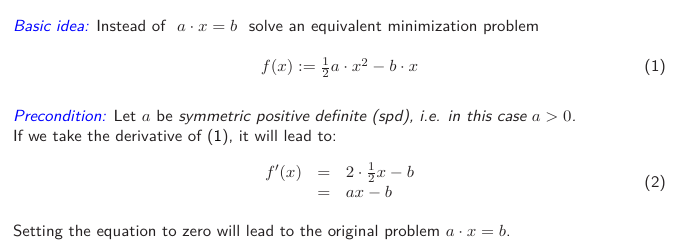
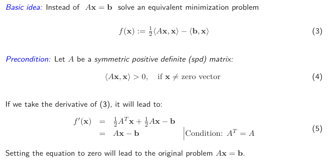
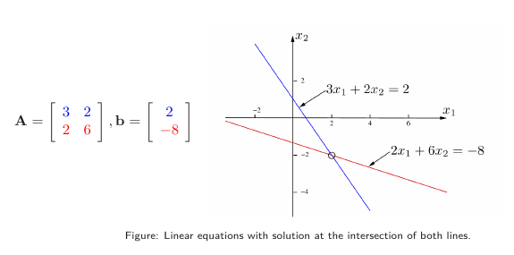

# Direct Methods
- Let us consider the solution of a system of linear equations $Ax = b$ with **non-singular** coefficient matrix $A \in \mathbb{R}^{n \times n}$, constant vector $b \in \mathbb{R}^n$ and (unknown) solution vector $x \in \mathbb{R}^n$. 
- ***Direct Methods*** compute the exact solution in *n* steps (in absence of round off error):
	- Cost of classical Gaussian Elimination: $O(n^3)$ 
	- Cost for sparse matrices: $O(n^{1.5})$ or $O(n^2)$
	- High memory consumption due to additional fill-in elements
- **Problem:** Complexity of Gaussian Elimination ("direct method") for LARGE (sparse) linear systems of equations is too high.
# Iterative Methods
- ***Iterative Methods*** use an (arbitrary) initial guess ("starting point") to compute an approximate solution:
	- Cost for conjugate-gradient algorithms: between $O(n)$ and $O(n^{\frac{3}{2}})$ (for an approximation using a fixed accuracy)
	- Non need for additional memory
	- Convergence after a few iterations (this depends, of course, also on $A$)
- **Problem:** However iterative methods are very often less robust and not as general as direct methods.
## Structure of an Iterative Methods
- ![[../../../Attachments/Pasted image 20231122154052.png|286]]
## Definition of Error and Residual
- The *error* in step *m* is the deviation of $x^{(m)}$ from the exact solution $x$:
$$
e^{(m)} = x - x^{(m)} = A^{-1}b-x^{(m)}
$$
- Unfortunately we do not know the error during the iterations (otherwise we would know also the exact solution, thus defying the purpose of using iterative solvers)
- The *residual* provides us a measure for the real error. It is relatively easy to compute:
$$
r^{(m)} = b - Ax^{(m)} = Ae^{(m)}
$$
- The fact that the residual is equivalent the A-transformed error ($Ae^{(m)}$) will be used late.
- Its *residual norm* is defined as $||r^{(m)}||$, whereas the *relative residual norm* is $\frac{||r^{(m)}||}{||b||}$. 
## Notation
![[../../../Attachments/Pasted image 20231122160011.png]]
# Gradient-Based Methods
- A class of first order methods utilized for finding the nearest local minimum of a function by following the direction of its negative gradient at the current point.
## Minimization Problem - 1D Case

## Minimization Problem

### Minimization Problem Example

## Method of Steepest Descent
## Convergence of Steepest Descent
### Impact of the Convergence
# Conjugate Gradient Method 
## Conjugate Search Direction
## Preconditioning

